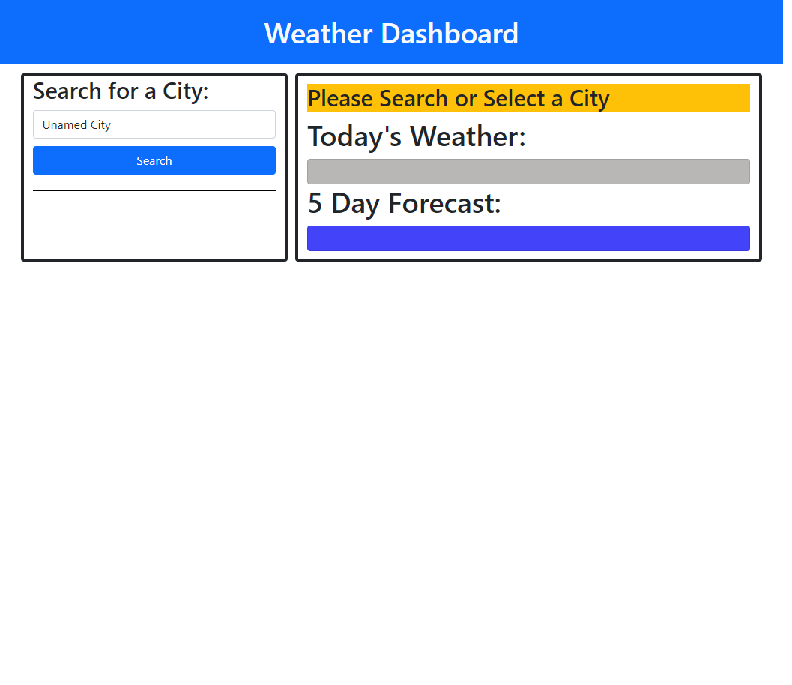
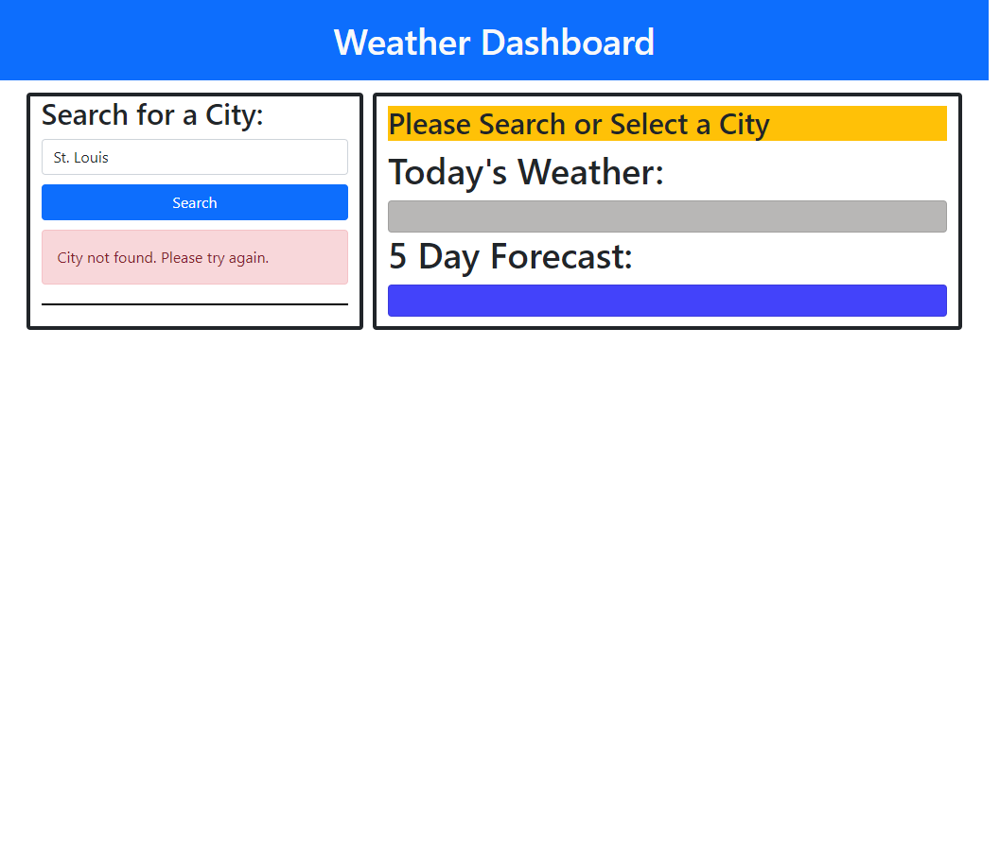
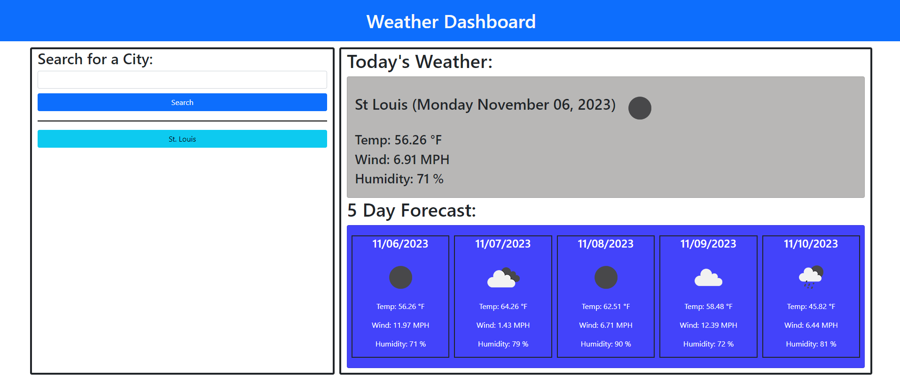
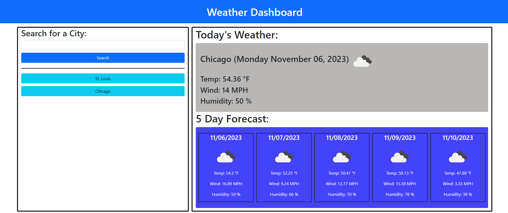

# Weather Dashboard

## Description

A website that displays the weather and 5 days afterwards. This website was made from scratch and uses the Open Weather Map API to get information on weather. The user can search for cities and the weather for that city is displayed. It shows what today's weather will look like as well as five days after. User searches are then saved in local storage (if the city exists within API). The javaScript code looks in local storage and makes buttons so I user can click on them to display the weather of that city. 

## Website URL

https://rallomatt.github.io/weatherDashboard/

## Screenshot

## Credits

Website for the API: https://openweathermap.org/

## License

Please refer to the LICENSE in the repo.